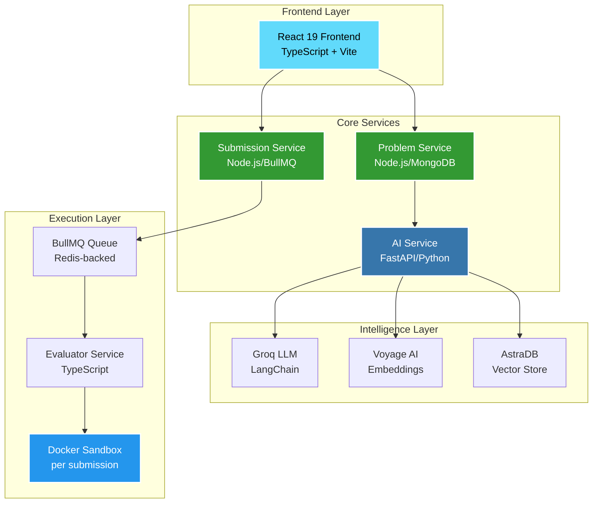

<!-- Header Banner -->
<div align="center">
  
</div>

<br/>

<!-- IMPORTANT ALERT BANNER - IMMEDIATELY VISIBLE -->
<div align="center">
  
  ⚠️ **NO CODE IN THIS REPO — DOCUMENTATION ONLY** ⚠️
  
</div>

<div align="center">
  
| 🚀 **MICROSERVICE** | 🔗 **REPOSITORY LINK** |
|:-------------------:|:----------------------:|
| 🤖 **AI Service** | [coderX_aiService](https://github.com/IamAbhinav01/coderX_aiService) |
| 📝 **Problem Service** | [coderX---Problem_Service](https://github.com/IamAbhinav01/coderX---Problem_Service) |
| 📤 **Submission Service** | [coderX---submissionService](https://github.com/IamAbhinav01/coderX---submissionService) |
| ⚡ **Evaluator Service** | [coderX--Evaluator-Service](https://github.com/IamAbhinav01/coderX--Evaluator-Service) |
| 🎨 **Frontend** | [coderX_FrontEnd](https://github.com/IamAbhinav01/coderX_FrontEnd) |

</div>

<div align="center">
  
  <a href="#"></a>
  <a href="#"></a>
  <a href="#"></a>
  
</div>

<br/>

---

## 🧠 Why This Exists

> **Most coding platforms rely on human-curated problem sets. coderX flips that script.**

An **AI service generates problems on demand** from a topic + difficulty prompt, a **vector similarity engine** ensures no near-duplicate ever gets stored, and an **isolated Docker judge** evaluates submissions in real-time.

🎯 **The vision:** A fully autonomous, scalable problem-setting and judging pipeline — with **zero human bottlenecks**.

---

## 🏗️ System Architecture



---

## 🤖 AI Service — The Intelligence Layer

The **AI Service** (`coderX_aiService`) is the most technically complex component. It's a standalone Python microservice that does three things:

### 1️⃣ LLM-Powered Problem Generation

Uses **Groq API via LangChain** to generate structured coding problems:

```python
# LangChain chain: prompt → Groq LLM → structured output
chain = prompt_template | groq_llm | output_parser
problem = chain.invoke({
    "topic": "Binary Trees", 
    "difficulty": "Hard"
})
# Returns: title, description, test_cases, editorial, complexity
```

### 2️⃣ Semantic Deduplication via Vector Search

Before storing any problem, checks for near-duplicates using **Voyage AI embeddings + AstraDB**:

```python
# Embed the new problem
embedding = voyage_client.embed([problem.description])

# Search for similar problems
similar = astra_collection.find(
    sort={"$vector": embedding},
    limit=5,
    projection={"$similarity": True}
)

# Reject if too similar
if similar[0]["$similarity"] > DEDUP_THRESHOLD:
    raise DuplicateProblemError("Too similar to existing")
```

### 3️⃣ Vector Storage

Problems that pass deduplication are stored with **1024-dim embeddings** for future similarity checks.

---

## ⚡ Evaluator Service — The Judge

The Evaluator Service (`coderX--Evaluator-Service`) runs submitted code inside **isolated Docker containers**:

| Feature | Implementation |
|---------|---------------|
| Job Queue | BullMQ (Redis-backed) |
| Isolation | Fresh Docker container per submission |
| Languages | Python, Java, C++ |
| Limits | CPU, memory, time limits enforced |
| Streaming | stdout/stderr in real time |

```typescript
// TypeScript: spin up container, run code, return verdict
const result = await containerFactory.run({
  language: 'python',
  code: submission.code,
  testCases: problem.testCases,
  timeLimit: 2000, // ms
  memoryLimit: 256, // MB
});
```

---

## 🔍 Key Technical Decisions

<details>
<summary><b>📌 Why BullMQ over direct execution?</b></summary>
<br/>
Submission spikes would overwhelm the judge. BullMQ decouples ingestion from execution, enabling horizontal scaling of evaluator workers independently.
</details>

<details>
<summary><b>📌 Why AstraDB over FAISS?</b></summary>
<br/>
FAISS requires in-memory index rebuilds on restart. AstraDB is a persistent, serverless vector store — the deduplication index survives service restarts and scales automatically.
</details>

<details>
<summary><b>📌 Why Groq over OpenAI?</b></summary>
<br/>
Groq's inference latency is ~10x lower for LLaMA3 models. Problem generation is a synchronous API call — low latency matters for UX.
</details>

---

## 🛠️ Full Tech Stack

| Layer | Technology | Badge |
|-------|------------|-------|
| **Frontend** | React 19, TypeScript, Vite, Tailwind |  |
| **Problem Service** | Node.js, Express, MongoDB |  |
| **Submission Service** | Node.js, BullMQ, Redis |  |
| **AI Service** | Python, FastAPI, LangChain |  |
| **Vector Store** | AstraDB, Voyage AI |  |
| **Judge** | TypeScript, Docker, dockerode |  |

---

## 🚀 Running Locally

### Prerequisites

```bash
✓ Node.js 18+
✓ Python 3.10+
✓ Docker
✓ Redis (for BullMQ)
✓ Groq API key + AstraDB credentials + Voyage AI key
```

### 1️⃣ AI Service

```bash
cd coderX_aiService
pip install -r requirements.txt
uvicorn main:app --reload --port 8001
```

### 2️⃣ Problem Service

```bash
cd coderX---Problem_Service
npm install
npm start  # port 3001
```

### 3️⃣ Submission Service

```bash
cd coderX---submissionService
npm install
npm start  # port 3002
```

### 4️⃣ Evaluator Service

```bash
cd coderX--Evaluator-Service
npm install
npm run dev  # consumes from BullMQ
```

### 5️⃣ Frontend

```bash
cd coderX_FrontEnd
npm install
npm run dev  # port 5173
```

---

## 📡 API Reference

### AI Service Endpoints

```
POST /api/v1/problems/generate
  Body: { "topic": "string", "difficulty": "Easy|Medium|Hard" }
  Returns: { problem, embedding_stored, dedup_passed }

GET  /api/v1/problems/
  Returns: paginated list of generated problems

GET  /health
  Returns: service status
```

### Submission Flow

```
POST /api/submissions        → enqueued to BullMQ
GET  /api/submissions/:id    → polls verdict
WS   /ws/submissions/:id     → real-time verdict stream (planned)
```

---

## 📊 Monitoring Dashboard

```bash
# BullMQ Queue Dashboard
http://localhost:3002/admin/queues
```

---

## 💡 What I Built End-to-End

This isn't a tutorial project. Every service was designed and implemented from scratch:

- ✅ Designed the **microservices split** (which service owns what)
- ✅ Chose **AstraDB over FAISS** after benchmarking persistence
- ✅ Tuned the **deduplication threshold** by testing against similar problems
- ✅ Dealt with **real Docker edge cases**: container cleanup, OOM kills, zombie processes
- ✅ Built **Bull Board integration** to monitor queue health

---

## 🔗 Microservices Quick Access

| Service | Repo | Tech Stack |
|:--------|:-----|:-----------|
| 🤖 AI Service | [coderX_aiService](https://github.com/IamAbhinav01/coderX_aiService) | Python, FastAPI, Groq, LangChain |
| 📝 Problem Service | [coderX---Problem_Service](https://github.com/IamAbhinav01/coderX---Problem_Service) | Node.js, Express, MongoDB |
| 📤 Submission Service | [coderX---submissionService](https://github.com/IamAbhinav01/coderX---submissionService) | Node.js, BullMQ, Redis |
| ⚡ Evaluator Service | [coderX--Evaluator-Service](https://github.com/IamAbhinav01/coderX--Evaluator-Service) | TypeScript, Docker, dockerode |
| 🎨 Frontend | [coderX_FrontEnd](https://github.com/IamAbhinav01/coderX_FrontEnd) | React 19, TypeScript, Vite, Tailwind |

---

## 👨‍💻 Author

<div align="center">
  
**Abhinav Sunil** — CSE (AI/ML), Lovely Professional University · Grad 2027

[](https://www.linkedin.com/in/abhinav-sunil-870184279/)
[](https://github.com/IamAbhinav01)
[](mailto:abhinavsunil@hotmail.com)

</div>

---

<div align="center">
  
</div>
```
