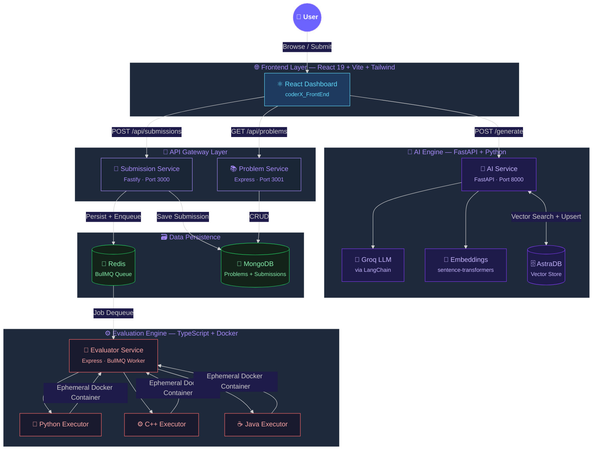
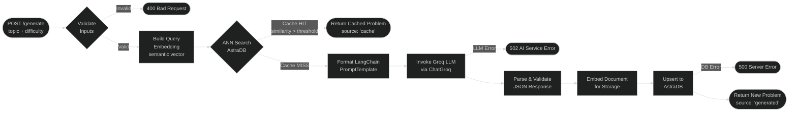
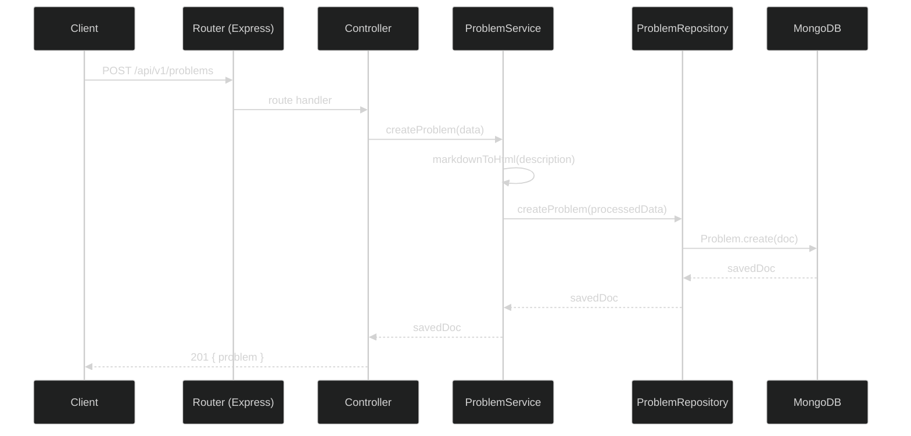
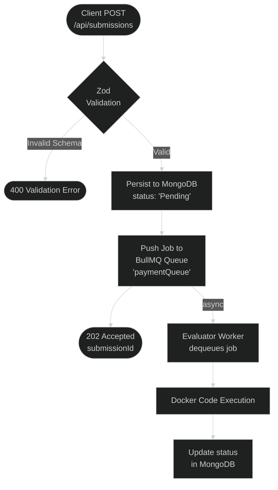
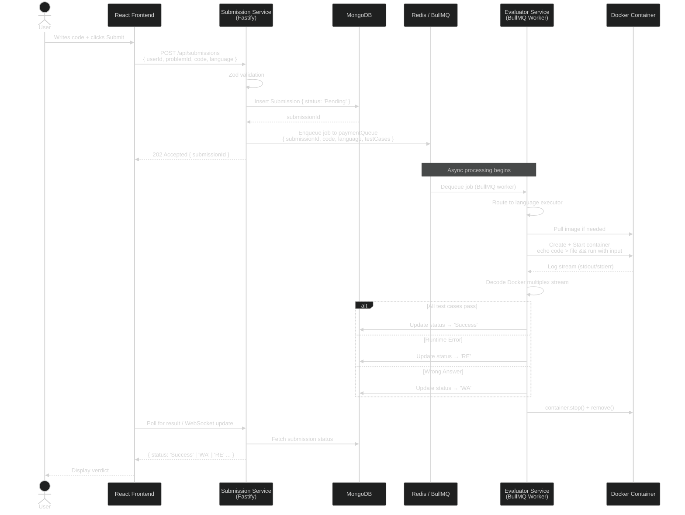
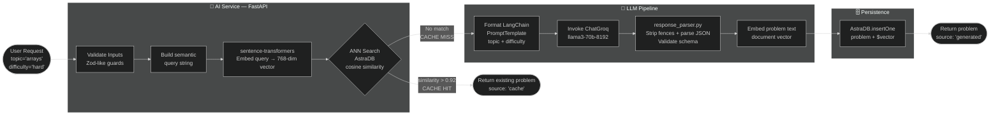
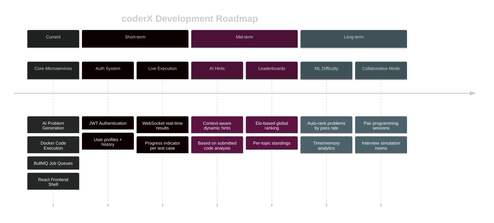

<p align="center">
  
</p>

<p align="center">
  
</p>

<br/>

<p align="center">
  <!-- Architecture -->
  
  
  
  
  <br/>
  <!-- Tech stack -->
  
  
  
  
  <br/>
  <!-- Status -->
  
  
  
</p>

---

<br/>

## 🌌 What is coderX?

**coderX** is a production-grade, AI-augmented competitive programming platform built on a fully decoupled **microservices architecture**. It acts as an autonomous problem-setter and judge — generating unique coding challenges with Large Language Models, deduplicating them via vector similarity search, and evaluating code submissions by running them inside isolated Docker containers.

Think **LeetCode**, but with a backend that _writes its own problems_ and a judge that _spins up fresh containers_ for every submission.

<br/>

> **🧠 Intelligence Layer** → Groq LLM + LangChain generates problems from a topic + difficulty prompt
>
> **🔍 Semantic Guard** → AstraDB vector search prevents near-duplicate problems from ever being stored
>
> **⚡ Judge System** → BullMQ job queue feeds code payloads to language-specific Docker executors
>
> **🖥️ Developer UX** → React 19 + Vite + Tailwind frontend for fast, modern problem solving

<br/>

---

## 🏗️ System Architecture



<br/>

---

## 📋 Microservices at a Glance

| # | Service | Role | Language | Port | Repo Link |
|---|---------|------|----------|------|-----------|
| 🧠 | **AI Service** | LLM problem generation + semantic dedup | Python / FastAPI | `8000` | [View Repo](#) |
| 📚 | **Problem Service** *(v1)* | Problem CRUD — original version | Node.js / Express | `3000` | [View Repo](#) |
| 📚 | **Problem Service** *(v2)* | Problem CRUD — refactored with Winston logging | Node.js / Express | `3000` | [View Repo](#) |
| 📡 | **Submission Service** | Accepts code submissions, enqueues to Redis | Node.js / Fastify | `3000` | [View Repo](#) |
| 🧪 | **Evaluator Service** | BullMQ worker — runs code in Docker | TypeScript / Express | `5000` | [View Repo](#) |
| 🌐 | **Frontend** | Developer-facing React SPA | React 19 + Vite | `5173` | [View Repo](#) |

<br/>

---

## 🔬 Deep Dive — Each Microservice

<br/>

---

### 🧠 AI Service — `coderX_aiService`

<p>
  
  
  
  
  
  
  
</p>

**Purpose:** This is the "autonomous problem-setter" of the platform. Given a `topic` and `difficulty`, it either retrieves a semantically similar problem from AstraDB (cache hit) or generates a brand new one via the Groq LLM and persists it with a vector embedding.

#### 📁 Directory Structure

```
coderX_aiService/
├── main.py                    ← FastAPI app entry point (ASGI)
├── pyproject.toml             ← uv-managed Python dependencies
├── app/
│   ├── config/
│   │   ├── langchainConfig.py ← Singleton ChatGroq client factory
│   │   ├── db.py              ← AstraDB connection setup
│   │   └── server.py          ← Environment variable loading
│   ├── routes/
│   │   └── problem_routes.py  ← POST /generate endpoint
│   ├── services/
│   │   └── question_generator.py ← Core generation pipeline
│   ├── prompts/
│   │   └── problemPrompt.py   ← LangChain PromptTemplate
│   ├── utils/
│   │   ├── embedder.py        ← Query & document embedding helpers
│   │   ├── response_parser.py ← LLM JSON response parser + validator
│   │   └── logger.py          ← Structured logging
│   ├── vector_store/
│   │   └── astra_store.py     ← ANN search + upsert into AstraDB
│   └── errors/
│       └── base_error.py      ← Custom HTTP error class
```

#### 🔄 Request Lifecycle (Problem Generation)



#### 🔑 Key Technical Decisions

| Decision | Rationale |
|----------|-----------|
| **Singleton `ChatGroq` client** | Avoids HTTP pool re-initialisation per request; keeps connections warm |
| **Query vs Document embeddings** | Separate embedding calls optimised for ANN search (query) vs storage (document) |
| **`parse_llm_response` validator** | Handles LLM JSON malformation (common with large editorials); strips markdown fences, retries parsing |
| **18 valid topics enforced** | Prevents prompt injection; constrains LLM scope to competitive programming domains |
| **AstraDB vector threshold** | Prevents near-duplicate problems from polluting the problem set |

#### ⚙️ Environment Variables

```bash
GROQ_API_KEY=gsk_...
GROQ_MODEL=llama3-70b-8192
GROQ_TEMPERATURE=0.7
GROQ_MAX_TOKENS=4096
ASTRA_DB_APPLICATION_TOKEN=AstraCS:...
ASTRA_DB_API_ENDPOINT=https://...
ASTRA_DB_NAMESPACE=coderx
ASTRA_COLLECTION_NAME=problems
```

#### 🚀 Run Locally

```bash
cd coderX_aiService
uv run uvicorn main:app --reload --port 8000
# Swagger UI → http://localhost:8000/docs
# ReDoc     → http://localhost:8000/redoc
```

#### 📡 API Endpoints

| Method | Path | Description | Response |
|--------|------|-------------|----------|
| `POST` | `/generate` | Generate or retrieve a problem | `{ source, problem }` |
| `GET` | `/health` | Liveness probe | `{ status: "ok" }` |
| `GET` | `/docs` | Swagger UI | — |
| `GET` | `/redoc` | ReDoc UI | — |

<br/>

---

### 📚 Problem Service v1 — `coderX---Problem_Service`

<p>
  
  
  
  
  
</p>

**Purpose:** The original RESTful CRUD backend for managing coding problems stored in MongoDB. Handles creation, retrieval, update, and deletion of `Problem` documents. Includes Markdown-to-HTML sanitization for problem descriptions via `marked` and `sanitize-html`.

#### 📁 Directory Structure

```
coderX---Problem_Service/
├── src/
│   ├── index.js              ← Express app bootstrap + DB connection
│   ├── config/
│   │   └── db.config.js      ← Mongoose connection factory
│   ├── models/
│   │   └── problem.model.js  ← Mongoose Problem schema
│   ├── routes/
│   │   ├── index.js          ← Router aggregator
│   │   └── v1/               ← Versioned API routes
│   ├── controllers/          ← Request/response handlers
│   ├── services/
│   │   └── problem.service.js ← Business logic layer
│   ├── repositories/         ← Data access layer (Mongoose ops)
│   ├── errors/               ← Custom error classes
│   └── utils/
│       └── ErrorHandler.js   ← Express error middleware
```

#### 🗃️ Problem Data Model

```javascript
Problem {
  title:       String  (required)
  description: String  (required, stored as sanitized HTML)
  difficulty:  String  enum['easy', 'medium', 'hard']
  testCases:   [{ input: String, output: String }]
  codeStubs:   [{
                  language: enum['python', 'java', 'cpp'],
                  startSnippet: String,
                  endSnippet:   String
               }]
  editorial:   String  (optional solution explanation)
  topic:       String  (e.g. "dynamic programming")
  createdAt:   Date    (auto-generated)
}
```

#### 🔄 Request Flow



#### 📡 API Endpoints

| Method | Path | Description |
|--------|------|-------------|
| `POST` | `/api/v1/problems` | Create a new problem |
| `GET` | `/api/v1/problems` | List all problems |
| `GET` | `/api/v1/problems/:id` | Get problem by ID |
| `PUT` | `/api/v1/problems/:id` | Update a problem |
| `DELETE` | `/api/v1/problems/:id` | Delete a problem |

#### 🚀 Run Locally

```bash
cd coderX---Problem_Service
npm install
npm run dev   # nodemon src/index.js on :3000
```

<br/>

---

### 📚 Problem Service v2 — `coderX_problem_service`

<p>
  
  
  
  
  
</p>

**Purpose:** An evolved, production-hardened version of the Problem Service. The architecture is identical to v1 but adds **structured Winston logging** with a MongoDB transport, meaning all log events are persisted to the database alongside the problem data — enabling audit trails and operational visibility.

#### 🔑 Differences from v1

| Feature | v1 | v2 |
|---------|----|----|
| Logging | `console.log` | Winston structured logger |
| Log transport | stdout only | stdout + MongoDB (winston-mongodb) |
| Log level control | None | `NODE_ENV`-aware |
| Dependency | — | `winston`, `winston-mongodb` |

#### 📁 Directory Structure

```
coderX_problem_service/
├── src/
│   ├── index.js              ← Express app bootstrap + DB connection
│   ├── config/               ← DB + server configs
│   ├── models/               ← Mongoose Problem schema (identical to v1)
│   ├── routes/               ← API route definitions
│   ├── controllers/          ← Request handlers
│   ├── services/
│   │   └── problem.service.js ← Business logic with Markdown processing
│   ├── repositories/         ← Data access layer
│   ├── errors/               ← Custom error types
│   └── utils/
│       ├── ErrorHandler.js   ← Global error middleware
│       └── markdownSanitiser.js ← marked + sanitize-html pipeline
```

#### 🚀 Run Locally

```bash
cd coderX_problem_service
npm install
MONGO_URI=mongodb://... npm run dev
```

<br/>

---

### 📡 Submission Service — `coderX_SubmissionService`

<p>
  
  
  
  
  
  
</p>

**Purpose:** The high-throughput ingestion gateway for code submissions. It uses **Fastify** (not Express) for its significantly higher request throughput, accepts a submission payload from the frontend, validates it with Zod, persists it to MongoDB with a `Pending` status, and dispatches a job to a **BullMQ queue** backed by Redis for the Evaluator to process.

#### 📁 Directory Structure

```
coderX_SubmissionService/
├── src/
│   ├── index.js              ← Fastify server bootstrap (port 3000)
│   ├── app.js                ← Plugin registration
│   ├── config/               ← Redis + DB config
│   ├── models/
│   │   └── submission.models.js ← Mongoose Submission schema
│   ├── routes/
│   │   └── api/              ← Versioned API routes
│   ├── controllers/          ← Fastify route handlers
│   ├── services/
│   │   ├── submission.service.js ← Core submission logic
│   │   └── servicePlugin.js  ← Fastify plugin wrapper
│   ├── producers/            ← BullMQ queue producers
│   ├── queue/                ← Queue initialization helpers
│   ├── repositories/         ← Mongoose data access layer
│   ├── errors/               ← HTTP error classes
│   └── validators/           ← Zod validation schemas
```

#### 🗃️ Submission Data Model

```javascript
Submission {
  userId:    String  (required)
  problemId: String  (required)
  code:      String  (required — the user's source code)
  language:  String  (required — 'python' | 'java' | 'cpp')
  status:    String  enum['Pending', 'Success', 'RE', 'TLE', 'MLE', 'WA']
                     default: 'Pending'
}
```

**Status Codes Explained:**

| Code | Meaning |
|------|---------|
| `Pending` | Enqueued, not yet evaluated |
| `Success` | All test cases passed |
| `RE` | Runtime Error |
| `TLE` | Time Limit Exceeded |
| `MLE` | Memory Limit Exceeded |
| `WA` | Wrong Answer |

#### 🔄 Submission Lifecycle



#### ⚙️ Environment Variables

```bash
REDIS_HOST=localhost
REDIS_PORT=6379
MONGO_URI=mongodb://...
PORT=3000
```

#### 🚀 Run Locally

```bash
cd coderX_SubmissionService
npm install
npm start   # nodemon src/index.js
```

<br/>

---

### 🧪 Evaluator Service — `coderX_EvaluatorService`

<p>
  
  
  
  
  
  
</p>

**Purpose:** This is the **Judge** — the most infrastructure-intensive service in the platform. It runs as a BullMQ worker, consuming code submission jobs from Redis. For each job, it spins up a **fresh, isolated Docker container** for the target language (Python, C++, or Java), executes the code against the provided test case input, captures stdout/stderr, and returns the result. Containers are destroyed immediately after execution.

#### 📁 Directory Structure

```
coderX_EvaluatorService/
├── src/
│   ├── main.ts               ← Express server + Worker initialization
│   ├── config/
│   │   ├── server.config.ts  ← Server port + env config
│   │   ├── redis.config.ts   ← ioredis connection
│   │   └── BullBoard.config.ts ← Bull Board dashboard adapter
│   ├── containers/
│   │   ├── containerFactory.ts ← Generic Docker container spawner
│   │   ├── dockerHelper.ts   ← Docker stream decoder (stdout/stderr mux)
│   │   ├── pullImage.ts      ← Docker image puller
│   │   ├── pythonExecutor.ts ← Python-specific Docker execution
│   │   ├── cppExecutor.ts    ← C++-specific Docker execution
│   │   └── javaExecutor.ts   ← Java-specific Docker execution
│   ├── workers/
│   │   └── sampleWorker.ts   ← BullMQ Worker factory
│   ├── jobs/
│   │   └── sampleJob.ts      ← Job handler class
│   ├── queues/
│   │   └── sampleQueue.ts    ← Queue definition (paymentQueue)
│   ├── producers/
│   │   └── sampleQueueProducers.ts ← Job enqueuer
│   ├── routes/               ← HTTP API routes
│   ├── controllers/
│   │   ├── ping.controller.ts ← Health check endpoint
│   │   └── submission.controller.ts ← Submission status endpoint
│   ├── dtos/                 ← Data Transfer Objects
│   ├── types/
│   │   └── codeExecutor.ts   ← ExecutionResponse interface
│   ├── utils/
│   │   └── constants.ts      ← Docker image names (PYTHON_IMAGE, etc.)
│   └── validators/           ← Zod schemas
```

#### 🐳 Docker Execution Pipeline

```mermaid
%%{init: {'theme': 'dark'}}%%
flowchart TD
    JOB([BullMQ Job\n{ code, language, testCase }]) --> ROUTER{Language\nRouter}

    ROUTER -->|python| PY[PythonExecutor]
    ROUTER -->|cpp| CPP[CppExecutor]
    ROUTER -->|java| JAVA[JavaExecutor]

    PY --> PULL[pullImage\nif not cached]
    CPP --> PULL
    JAVA --> PULL

    PULL --> CREATE[containerFactory.ts\nspawn Docker container]
    CREATE --> RUN[container.start()]
    RUN --> STREAM[Capture Log Stream\nstdout + stderr]
    STREAM --> DECODE[dockerHelper.ts\nDecode Docker Multiplex Frame]
    DECODE -->|stderr present| ERR([RE — Runtime Error])
    DECODE -->|stdout only| SUCCESS([Success Response\noutput: string])
    SUCCESS & ERR --> CLEANUP[container.stop()\ncontainer.remove()]
```

#### 🔑 How Code Execution Works

Each executor follows this exact pattern:
```typescript
// Example: PythonExecutor (simplified)
1. Pull Docker image (python:3.11-alpine) if not present
2. Create container with command:
   sh -c "echo '<code>' > test.py && echo '<input>' | python3 test.py"
3. Start container & attach log stream (stdout + stderr)
4. Await stream 'end' event
5. Decode Docker multiplexed stream (8-byte header per frame)
6. If stderr → reject with runtime error
7. If stdout → resolve with output string
8. finally: container.stop() + container.remove()
```

#### 📊 Bull Board Dashboard

The service exposes an admin UI at `/admin/queues` (via `@bull-board/express`) for real-time queue monitoring — inspect pending, active, completed, and failed jobs.

#### 🚀 Run Locally

```bash
cd coderX_EvaluatorService
npm install
npm run dev   # ts-node src/main.ts via nodemon
# Bull Board → http://localhost:5000/admin/queues
```

#### ⚙️ Environment Variables

```bash
PORT=5000
REDIS_HOST=localhost
REDIS_PORT=6379
```

<br/>

---

### 🌐 Frontend — `coderX_FrontEnd`

<p>
  
  
  
  
</p>

**Purpose:** The developer-facing Single Page Application. Built with React 19, Vite 8, TypeScript, and Tailwind CSS. Currently implements a hero landing page showcasing the coderX brand and CTA buttons for problem generation and discovery.

#### 📁 Directory Structure

```
coderX_FrontEnd/
├── index.html                ← App shell
├── vite.config.ts            ← Vite config (@vitejs/plugin-react)
├── tailwind.config.js        ← Tailwind theme config
├── tsconfig.json             ← TypeScript base config
├── src/
│   ├── main.tsx              ← React DOM root mount
│   ├── App.tsx               ← Application root component
│   ├── App.css               ← Global base styles
│   ├── index.css             ← Tailwind directives
│   ├── assets/
│   │   └── hero.png          ← Hero section image
│   └── components/
│       ├── Hero.tsx          ← Landing hero section
│       └── Hero.module.css   ← CSS Modules for hero
```

#### 🖥️ UI Components

| Component | Description |
|-----------|-------------|
| `Hero` | Landing page hero with animated coderX branding, tagline, and CTAs |

#### 🌟 Hero Component Features

- Animated **coderX** brand with kinetic `X` effect (CSS animation)
- Tagline: *"Elevate your technical skills with AI-engineered coding interview questions tailored exactly to your seniority and target role."*
- CTA buttons: **Generate Problem** and **Learn More**
- Responsive layout with hero image panel

#### 🚀 Run Locally

```bash
cd coderX_FrontEnd
npm install
npm run dev   # Vite dev server on http://localhost:5173
```

<br/>

---

## ⚡ End-to-End Submission Workflow



<br/>

---

## 🧠 AI Problem Generation Workflow



<br/>

---

## 🛠️ Tech Stack Summary

### Languages & Runtimes

| Technology | Used In | Purpose |
|------------|---------|---------|
| **Python 3.10+** | AI Service | FastAPI app, LLM integration, embeddings |
| **TypeScript** | Evaluator Service | Type-safe BullMQ workers, Docker executors |
| **JavaScript (ESM/CJS)** | Problem Service, Submission Service | Node.js backend services |
| **TSX / React** | Frontend | Component-based UI |

### Infrastructure & Databases

| Technology | Role |
|------------|------|
| **Docker** | Sandboxed code execution (Python, C++, Java containers) |
| **Redis** | BullMQ message broker for submission queues |
| **MongoDB + Mongoose** | Problem and submission persistence |
| **AstraDB (Cassandra)** | Vector database for semantic problem search |

### AI / ML Stack

| Technology | Role |
|------------|------|
| **Groq** | Ultra-fast LLM inference (llama3-70b) |
| **LangChain** | LLM orchestration, PromptTemplate management |
| **sentence-transformers** | Local embedding model (BAAI/bge-large-en-v1.5, 1024-dim) |

### Key Libraries

| Library | Service | Purpose |
|---------|---------|---------|
| `bullmq` | Submission + Evaluator | Job queue management |
| `dockerode` | Evaluator | Docker container API client |
| `@bull-board` | Evaluator | Queue monitoring dashboard |
| `fastify` | Submission | High-throughput HTTP server |
| `zod` | Submission + Evaluator | Runtime schema validation |
| `pydantic v2` | AI Service | Data validation + serialization |
| `marked` + `sanitize-html` | Problem Services | Markdown-to-HTML rendering |
| `winston` + `winston-mongodb` | Problem Service v2 | Structured log persistence |
| `astrapy` | AI Service | AstraDB Python SDK |

<br/>

---

## 🚀 Getting Started

### Prerequisites

```bash
# Required services
docker --version    # >= 20.x
redis-server        # >= 7.x
mongod              # >= 6.x

# Runtimes
node --version      # >= 20.x LTS
python --version    # >= 3.10
uv --version        # Python package manager (recommended)
```

### 1. Clone the Monorepo

```bash
git clone https://github.com/IamAbhinav01/coderX.git
cd coderX
```

### 2. Launch Infrastructure

```bash
# Start Redis
docker run -d -p 6379:6379 redis:7-alpine

# Start MongoDB
docker run -d -p 27017:27017 mongo:6
```

### 3. Start Each Service

```bash
# Terminal 1 — AI Service
cd coderX_aiService && cp .env.example .env   # fill in API keys
uv run uvicorn main:app --reload --port 8000

# Terminal 2 — Problem Service (v2)
cd coderX_problem_service && npm install
MONGO_URI=mongodb://localhost:27017/coderx npm run dev

# Terminal 3 — Submission Service
cd coderX_SubmissionService && npm install
npm start

# Terminal 4 — Evaluator Service
cd coderX_EvaluatorService && npm install
npm run dev

# Terminal 5 — Frontend
cd coderX_FrontEnd && npm install
npm run dev   # → http://localhost:5173
```

### Default Port Map

| Service | Port |
|---------|------|
| Frontend | `5173` |
| AI Service | `8000` |
| Problem Service | `3000` |
| Submission Service | `3000` |
| Evaluator Service | `5000` |
| Bull Board UI | `5000/admin/queues` |
| Redis | `6379` |
| MongoDB | `27017` |

<br/>

---

## 🔮 Roadmap



<br/>

---

## 📊 Project Stats

<p align="center">
  
  
</p>

<p align="center">
  
</p>

<br/>

---

## 👨‍💻 Author

<p align="center">
  <b>Abhinav Sunil</b><br/>
  <i>AI Engineer · Backend Architect · Systems Builder</i><br/><br/>
  <a href="#">
    
  </a>
  <a href="#">
    
  </a>
  <a href="#">
    
  </a>
</p>

<br/>

---

<p align="center">
  
</p>

<p align="center">
  <sub>© 2026 coderX — MIT License</sub>
</p>
